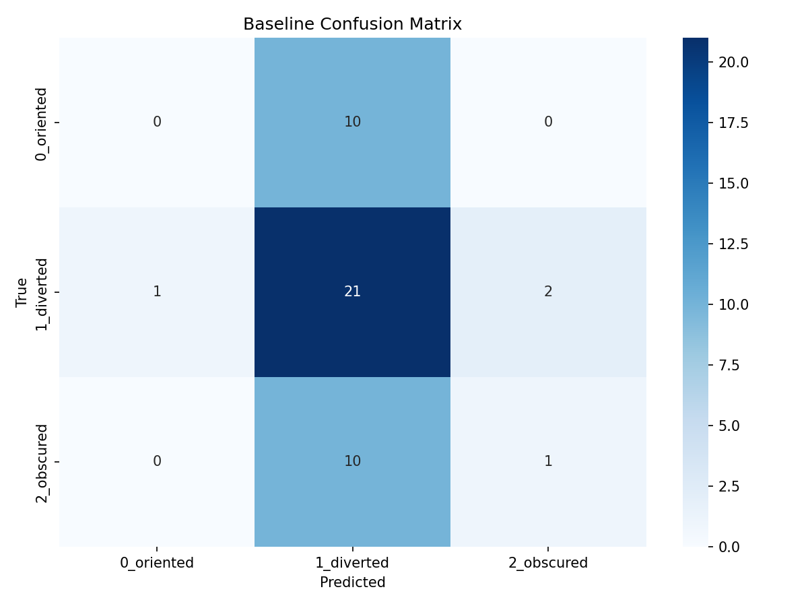

# Classroom Engagement Telemetry

A lightweight deep learning pipeline for estimating classroom engagement from video telemetry using YOLOv8 person detection and MobileNetV2 posture classification — designed for edge deployment and enterprise-scale observability.

## Cloud Architecture


*Enterprise AWS architecture — edge inference with ONNX on Greengrass, encrypted ingestion via Firehose, dual hot/cold analytics paths (Timestream + Athena), and a SageMaker retraining loop for continuous model improvement.*

## Live Demo

Try the model interactively with Grad-CAM visualization: [Hugging Face Space](https://huggingface.co/spaces/ummanmm/Classroom-Engagement-Demo)

## Pipeline Overview

```plain
Raw Videos → Frame Extraction → Person Detection/Cropping → Train/Val/Test Split
→ MobileNetV2 Training → Evaluation → Engagement Telemetry Dashboard
→ ONNX Export → Edge Deployment → Cloud Ingestion → Analytics
```

## Setup

```bash
make setup
```

Generating the AWS architecture diagram requires the `awsdac` CLI:

- macOS: `brew install awsdac`
- Go: `go install github.com/awslabs/diagram-as-code/cmd/awsdac@latest`

## Pipeline Steps (run in order)

Run the full pipeline end-to-end with a single command:

```bash
make all
```

Or run individual steps:

| Step | Command                    | Description                                                     |
| ---- | -------------------------- | --------------------------------------------------------------- |
| 1    | `make extract-frames`      | Extract one frame every 10 seconds from raw videos              |
| 2    | `make crop-students`       | Run YOLOv8n person detection and crop bounding boxes            |
| 3    | `make split-data`          | Split crops into train/val/test by video source                 |
| 4    | *(manual)*                 | Annotate crops into `0_oriented/`, `1_diverted/`, `2_obscured/` |
| 5    | `make train-baseline`      | Train MobileNetV2 classifier with weighted loss                 |
| 6    | `make evaluate-baseline`   | Evaluate on test set, generate confusion matrix and CSV         |
| 7    | `make generate-telemetry`  | Run chronological inference and plot engagement dashboard       |
| 8    | `make generate-gradcam`    | Generate Grad-CAM attention heatmaps for error analysis         |
| 9    | `make tsne`                | Generate t-SNE embedding visualization of test-set features     |
| 10   | `make benchmark`           | Export ONNX model and run CPU latency benchmark                 |
| 11   | `make visualize-video`     | Generate annotated + privacy-anonymized demo video              |
| 12   | `make plot-curves`         | Plot training loss and accuracy curves from history CSV         |
| 13   | `make diagram`             | Generate AWS enterprise architecture diagram (requires awsdac)  |

## Live System Demo

[Watch the privacy-anonymized classroom demo video](results/classroom_demo_anonymized.mp4)

*Real-time engagement detection with color-coded bounding boxes (green = oriented, red = diverted), Gaussian face blur for privacy, and a telemetry HUD overlay showing per-frame engagement ratios.*

## Model Evaluation & Domain Shift


*Training and validation loss/accuracy over 15 epochs.*


*t-SNE 2D projection of MobileNetV2 bottleneck features showing class separability.*



*Per-class confusion matrix on the held-out test set.*


*Temporal engagement ratio dashboard with smoothing window.*


*Grad-CAM attention heatmaps comparing correctly classified vs. misclassified crops — the model attends to upper-body posture cues.*

## Directory Structure

```plain
classroom_engagement_telemetry/
├── data/
│   ├── raw_videos/                     # Source .mp4 files (git-ignored)
│   ├── extracted_frames/               # One frame per 10 seconds
│   └── crops/
│       ├── train/
│       │   ├── 0_oriented/
│       │   ├── 1_diverted/
│       │   └── 2_obscured/
│       ├── val/
│       │   ├── 0_oriented/
│       │   ├── 1_diverted/
│       │   └── 2_obscured/
│       └── test/
│           ├── 0_oriented/
│           ├── 1_diverted/
│           └── 2_obscured/
├── src/
│   ├── data/
│   │   ├── extract_frames.py           # Downsample video to 1 frame / 10s
│   │   ├── crop_students.py            # YOLOv8n person detection and cropping
│   │   └── split_data.py               # Strict video-level train/val/test split
│   ├── models/
│   │   ├── train_baseline.py           # MobileNetV2 training with weighted loss
│   │   ├── optimize_onnx.py            # ONNX export and CPU benchmark
│   │   ├── publish_to_huggingface.py   # Upload weights to Hugging Face Hub
│   │   ├── create_hf_space.py          # Deploy Gradio Space to Hugging Face
│   │   ├── best_baseline.pth           # Saved best weights (git-ignored)
│   │   ├── model.onnx                  # ONNX-optimized model (git-ignored)
│   │   └── yolov8n.pt                  # YOLOv8-nano detector (git-ignored)
│   ├── eval/
│   │   ├── evaluate_baseline.py        # Test-set metrics, confusion matrix, CSV
│   │   ├── generate_telemetry.py       # Chronological engagement dashboard
│   │   ├── generate_gradcam.py         # Grad-CAM attention heatmaps
│   │   ├── visualize_embeddings.py     # t-SNE feature-space visualization
│   │   ├── visualize_video.py          # Annotated + anonymized demo video
│   │   └── plot_curves.py              # Training loss/accuracy curves
│   └── docs/
│       └── aws_architecture.yaml       # AWS enterprise architecture (DAC)
├── results/                            # Generated pipeline outputs
│   ├── aws_enterprise_architecture.png
│   ├── baseline_confusion_matrix.png
│   ├── classroom_demo_anonymized.mp4
│   ├── classroom_telemetry_dashboard.png
│   ├── gradcam_analysis.png
│   ├── history.csv
│   ├── test_predictions.csv
│   ├── training_curves.png
│   └── tsne_clusters.png
├── notebooks/
│   └── EDA_and_Testing.ipynb           # Exploratory data analysis notebook
├── .github/
│   └── workflows/
│       └── ci.yml                      # GitHub Actions lint + smoke test
├── config.yaml                         # Centralized hyperparameters and paths
├── requirements.txt                    # Python dependencies
├── Makefile                            # Pipeline orchestration commands
├── LICENSE
├── .gitignore
└── README.md
```

## Outputs

- `src/models/best_baseline.pth` — Best model weights (by val accuracy)
- `src/models/model.onnx` — ONNX-optimized model for edge deployment
- `results/baseline_confusion_matrix.png` — Per-class precision/recall visualization
- `results/test_predictions.csv` — Per-image predictions with confidence scores for error analysis
- `results/history.csv` — Epoch-wise training/validation loss and accuracy curves
- `results/classroom_telemetry_dashboard.png` — Engagement ratio over time with temporal smoothing
- `results/gradcam_analysis.png` — Grad-CAM attention heatmaps comparing correct vs. misclassified crops
- `results/tsne_clusters.png` — t-SNE 2D projection of MobileNetV2 bottleneck features
- `results/training_curves.png` — Training and validation loss/accuracy over epochs
- `results/classroom_demo_anonymized.mp4` — Privacy-anonymized video with engagement overlay
- `results/aws_enterprise_architecture.png` — AWS enterprise scaling architecture diagram

## Architecture Details

The cloud architecture implements a dual-path data strategy:

- **Hot Path (Real-time):** Greengrass edge inference streams anonymized engagement scores through IoT Core and Firehose into Amazon Timestream. Grafana dashboards display live classroom engagement ratios. CloudWatch Alarms trigger Lambda functions for automated alerting.

- **Cold Path (Historical):** Firehose simultaneously lands raw JSON logs in S3. Amazon Athena enables university researchers to run ad-hoc SQL queries across years of historical data (e.g., comparing engagement patterns across semesters) — serverless, pay-per-query.

- **Security & Compliance:** AWS KMS provides customer-managed encryption keys for all data at rest in S3 and Timestream, satisfying FERPA and GDPR requirements for student telemetry data.

- **MLOps Retraining Loop:** Amazon SageMaker pulls historical training data from S3, retrains the MobileNetV2 classifier to counteract data drift, and pushes updated ONNX weights back to classroom edge devices via Greengrass OTA updates.

## Configuration

All hyperparameters and paths are centralized in `config.yaml`.

## Requirements

Python 3.10+ with packages listed in `requirements.txt`. Install via `make setup`.

## Design Rationale (Edge/CPU Constraints)

This pipeline was intentionally designed to run on local, consumer-grade hardware (e.g., AMD Ryzen 7 CPU) without requiring cloud GPU instances.

- **Extraction:** 10-second downsampling reduces 4GB of raw video to lightweight chronological batches.
- **Models:** YOLOv8-nano and MobileNetV2 were explicitly chosen for their highly optimized, depthwise-separable convolutions, allowing for rapid CPU inference.

## Ethical Considerations & Privacy

This pipeline is designed strictly for **Observability**, not surveillance.

- **No Biometrics:** The system does not perform facial recognition or identity tracking.
- **Posture-Only:** Classification is based purely on geometric posture heuristics (Oriented vs. Diverted).
- **Aggregate Telemetry:** Outputs are smoothed into macro-level classroom engagement ratios. No individual student data or images are stored in the final telemetry outputs.

## License

This project is licensed under the [MIT License](LICENSE).
