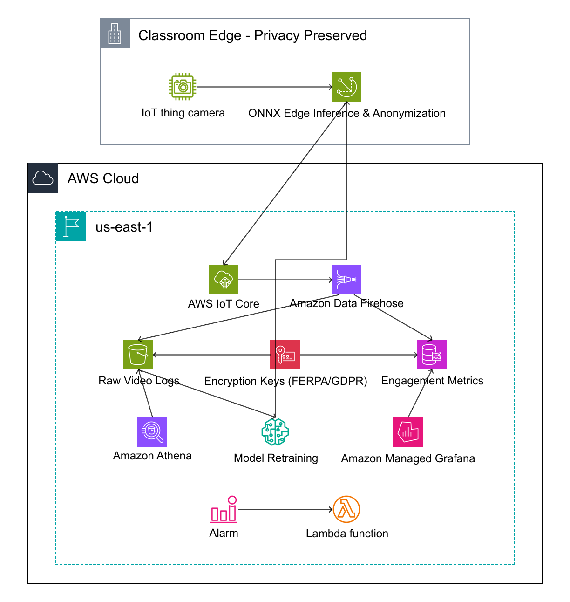
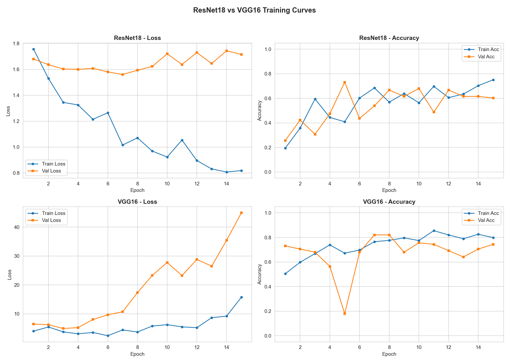
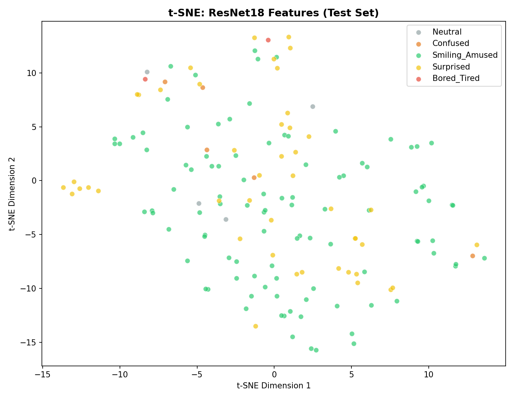
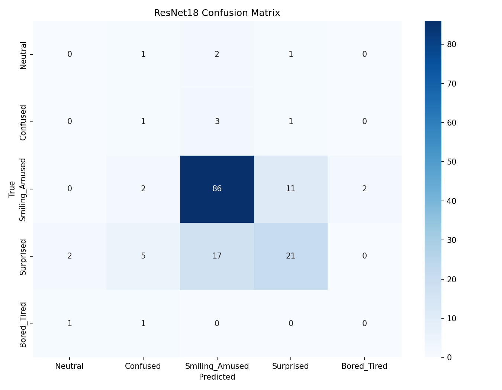
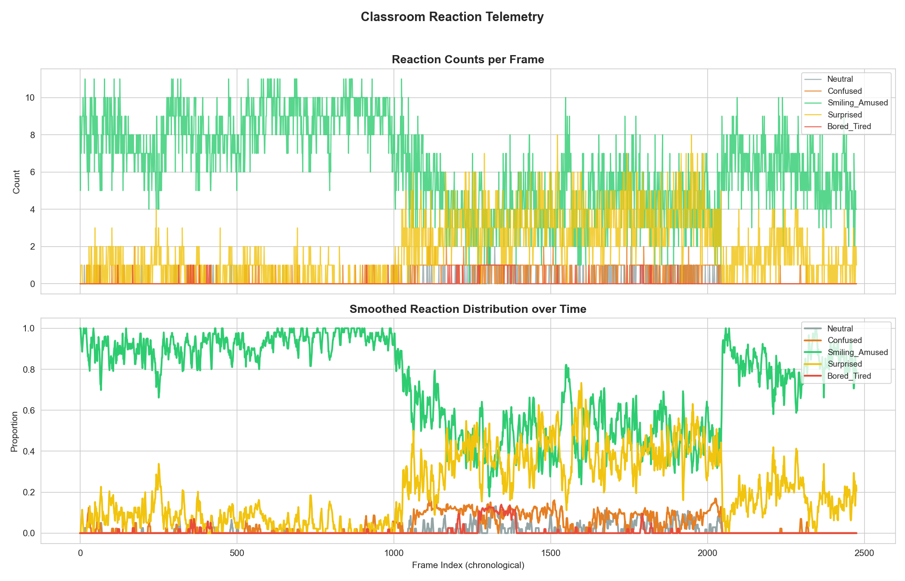
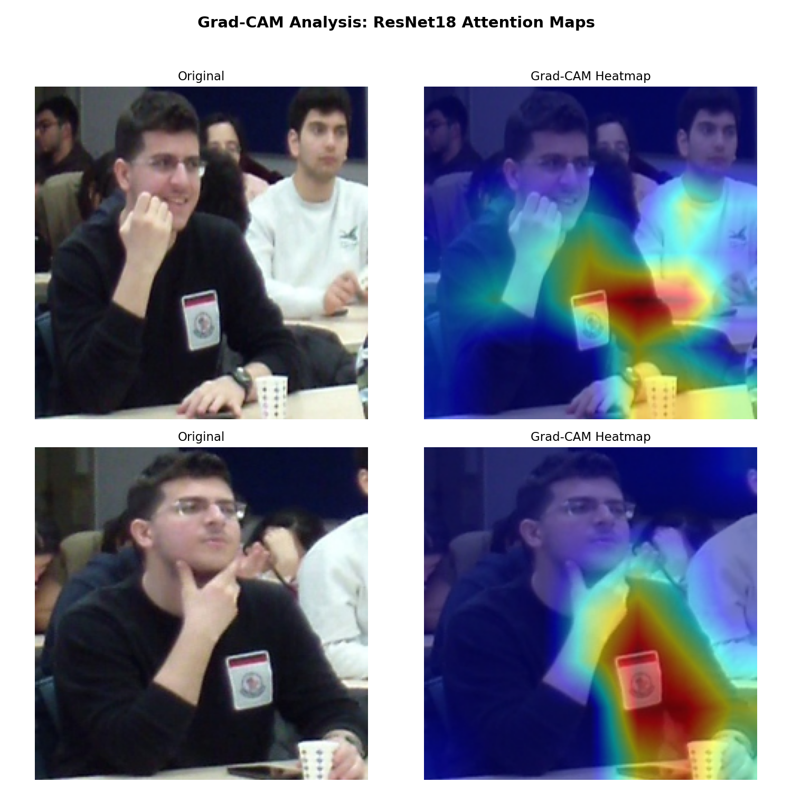

# Classroom Reaction Recognition

A deep learning pipeline for recognizing student facial reactions from classroom video using YOLOv8 person detection and comparative transfer learning with ResNet18 and VGG16.

## Cloud Architecture



*Enterprise AWS architecture -- edge inference with ONNX on Greengrass, encrypted ingestion via Firehose, dual hot/cold analytics paths (Timestream + Athena), and a SageMaker retraining loop for continuous model improvement.*

## Live Demo

Try the model interactively with Grad-CAM visualization: [Hugging Face Space](https://huggingface.co/spaces/ummanmm/Classroom-Reaction-Demo)

## Pipeline Overview

```plain
Raw Videos -> Frame Extraction (1 FPS) -> Person Detection/Cropping -> Manual Annotation
-> 70/10/20 Stratified Split -> ResNet18 & VGG16 Training -> Evaluation & Comparison
-> Reaction Telemetry Dashboard -> ONNX Export -> Edge Deployment
```

## Reaction Classes

| Index | Folder Name       | Visual Cues                        |
|-------|-------------------|------------------------------------|
| 0     | `Neutral`         | No visible expression              |
| 1     | `Confused`        | Furrowed brow, squinting           |
| 2     | `Smiling_Amused`  | Visible smile, laughter            |
| 3     | `Surprised`       | Raised eyebrows, open mouth        |
| 4     | `Bored_Tired`     | Yawning, blank stare               |

## Setup

```bash
make setup
```

Generating the AWS architecture diagram requires the `awsdac` CLI:

- macOS: `brew install awsdac`
- Go: `go install github.com/awslabs/diagram-as-code/cmd/awsdac@latest`

## Pipeline Steps (run in order)

Run the full pipeline end-to-end with a single command:

```bash
make all
```

Or run individual steps:

| Step | Command                    | Description                                                     |
| ---- | -------------------------- | --------------------------------------------------------------- |
| 1    | `make extract-frames`      | Extract one frame per second from raw videos                    |
| 2    | `make crop-students`       | Run YOLOv8n person detection and crop bounding boxes            |
| 3    | *(manual)*                 | Annotate crops into class folders by facial expression          |
| 4    | `make split-data`          | Stratified 70/10/20 split into train/val/test                   |
| 5    | `make train-baseline`      | Train ResNet18 and VGG16 classifiers with weighted loss         |
| 6    | `make evaluate-baseline`   | Evaluate both models, generate confusion matrices and comparison|
| 7    | `make generate-telemetry`  | Run chronological inference and plot reaction dashboard         |
| 8    | `make generate-gradcam`    | Generate Grad-CAM attention heatmaps for error analysis         |
| 9    | `make tsne`                | Generate t-SNE embedding visualization of test-set features     |
| 10   | `make benchmark`           | Export ONNX model, CPU latency benchmark, and parity assertion  |
| 11   | `make visualize-video`     | Generate annotated demo video with reaction labels              |
| 12   | `make plot-curves`         | Plot training loss and accuracy curves for both models          |
| 13   | `make diagram`             | Generate AWS enterprise architecture diagram (requires awsdac)  |

## Model Evaluation



*Training and validation loss/accuracy over 15 epochs for ResNet18 and VGG16.*



*t-SNE 2D projection of ResNet18 features showing class separability across 5 reaction classes.*



*Per-class confusion matrix on the held-out test set (ResNet18).*



*Temporal reaction distribution dashboard with smoothing window.*



*Grad-CAM attention heatmaps comparing correctly classified vs. misclassified crops -- the model attends to facial expression cues.*

## Directory Structure

```plain
classroom_engagement_telemetry/
├── data/
│   ├── raw_videos/                     # Source .mp4 files (git-ignored)
│   ├── extracted_frames/               # One frame per second
│   └── crops/
│       ├── train/{class}/              # Training split (70%)
│       ├── val/{class}/                # Validation split (10%)
│       └── test/{class}/              # Test split (20%)
├── src/
│   ├── data/
│   │   ├── extract_frames.py           # Downsample video to 1 FPS
│   │   ├── crop_students.py            # YOLOv8n person detection and cropping
│   │   └── split_data.py              # Stratified 70/10/20 train/val/test split
│   ├── models/
│   │   ├── train_baseline.py           # ResNet18 + VGG16 dual training
│   │   ├── optimize_onnx.py            # ONNX export and CPU benchmark
│   │   ├── publish_to_huggingface.py   # Upload weights to Hugging Face Hub
│   │   ├── create_hf_space.py          # Deploy Gradio Space to Hugging Face
│   │   ├── best_resnet18.pth           # Best ResNet18 weights (git-ignored)
│   │   ├── best_vgg16.pth              # Best VGG16 weights (git-ignored)
│   │   ├── model.onnx                  # ONNX-optimized model (git-ignored)
│   │   └── yolov8n.pt                  # YOLOv8-nano detector (git-ignored)
│   ├── eval/
│   │   ├── evaluate_baseline.py        # Test-set metrics, confusion matrices, comparison
│   │   ├── generate_telemetry.py       # Chronological reaction dashboard
│   │   ├── generate_gradcam.py         # Grad-CAM attention heatmaps
│   │   ├── visualize_embeddings.py     # t-SNE feature-space visualization
│   │   ├── visualize_video.py          # Annotated demo video
│   │   └── plot_curves.py              # Training loss/accuracy curves
│   └── docs/
│       └── aws_architecture.yaml       # AWS enterprise architecture (DAC)
├── results/                            # Generated pipeline outputs
│   ├── aws_enterprise_architecture.png
│   ├── resnet18_confusion_matrix.png
│   ├── vgg16_confusion_matrix.png
│   ├── model_comparison.csv
│   ├── classroom_demo.mp4
│   ├── classroom_telemetry_dashboard.png
│   ├── gradcam_analysis.png
│   ├── history_resnet18.csv
│   ├── history_vgg16.csv
│   ├── resnet18_test_predictions.csv
│   ├── vgg16_test_predictions.csv
│   ├── training_curves.png
│   └── tsne_clusters.png
├── notebooks/
│   ├── EDA_and_Testing.ipynb           # Exploratory data analysis notebook
│   └── Reaction_Recognition_Colab.ipynb # Google Colab training notebook
├── reaction_dataset.zip                # Packaged train/val/test splits for Colab
├── .github/
│   └── workflows/
│       └── ci.yml                      # GitHub Actions lint + smoke test
├── config.yaml                         # Centralized hyperparameters and paths
├── requirements.txt                    # Python dependencies
├── Makefile                            # Pipeline orchestration commands
├── LICENSE
├── .gitignore
└── README.md
```

## Outputs

- `src/models/best_resnet18.pth` -- Best ResNet18 weights (by val accuracy)
- `src/models/best_vgg16.pth` -- Best VGG16 weights (by val accuracy)
- `src/models/model.onnx` -- ONNX-optimized ResNet18 for edge deployment
- `notebooks/Reaction_Recognition_Colab.ipynb` -- Self-contained Colab training notebook
- `reaction_dataset.zip` -- Packaged train/val/test splits for upload to Google Drive
- `results/resnet18_confusion_matrix.png` -- ResNet18 per-class confusion matrix
- `results/vgg16_confusion_matrix.png` -- VGG16 per-class confusion matrix
- `results/model_comparison.csv` -- Side-by-side Accuracy, Precision, Recall, F1
- `results/resnet18_test_predictions.csv` -- Per-image predictions with confidence
- `results/vgg16_test_predictions.csv` -- Per-image predictions with confidence
- `results/history_resnet18.csv` -- ResNet18 epoch-wise training/validation metrics
- `results/history_vgg16.csv` -- VGG16 epoch-wise training/validation metrics
- `results/classroom_telemetry_dashboard.png` -- Reaction distribution over time
- `results/gradcam_analysis.png` -- Grad-CAM attention heatmaps
- `results/tsne_clusters.png` -- t-SNE 2D projection of ResNet18 features
- `results/training_curves.png` -- Training curves for both models
- `results/classroom_demo.mp4` -- Annotated demo video with reaction labels
- `results/aws_enterprise_architecture.png` -- AWS enterprise architecture diagram

## Architecture Details

The cloud architecture implements a dual-path data strategy:

- **Hot Path (Real-time):** Greengrass edge inference streams reaction scores through IoT Core and Firehose into Amazon Timestream. Grafana dashboards display live classroom reaction distributions. CloudWatch Alarms trigger Lambda functions for automated alerting.

- **Cold Path (Historical):** Firehose simultaneously lands raw JSON logs in S3. Amazon Athena enables university researchers to run ad-hoc SQL queries across years of historical data (e.g., comparing reaction patterns across semesters) -- serverless, pay-per-query.

- **Security & Compliance:** AWS KMS provides customer-managed encryption keys for all data at rest in S3 and Timestream.

- **MLOps Retraining Loop:** Amazon SageMaker pulls historical training data from S3, retrains classifiers to counteract data drift, and pushes updated ONNX weights back to classroom edge devices via Greengrass OTA updates.

## Configuration

All hyperparameters and paths are centralized in `config.yaml`.

## Requirements

Python 3.10+ with packages listed in `requirements.txt`. Install via `make setup`.

## Design Rationale

- **Extraction:** 1-second downsampling captures sufficient temporal resolution for facial expression changes.
- **Models:** ResNet18 and VGG16 are compared using transfer learning with ImageNet pre-trained weights. Both architectures freeze convolutional features and fine-tune only the classification head.
- **Detection:** YOLOv8-nano provides fast person detection suitable for CPU inference.

## License

This project is licensed under the [MIT License](LICENSE).
